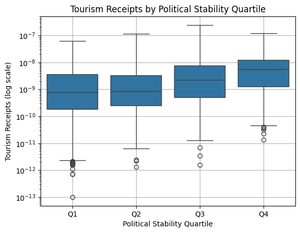
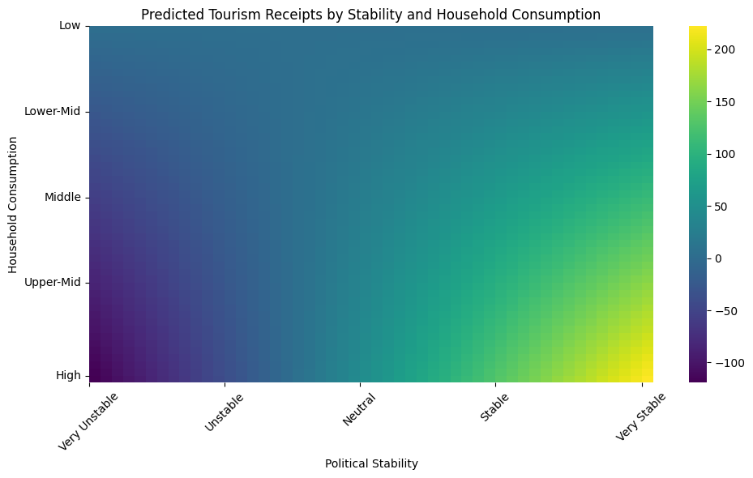
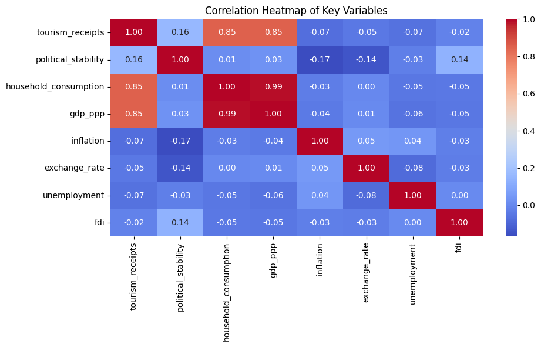
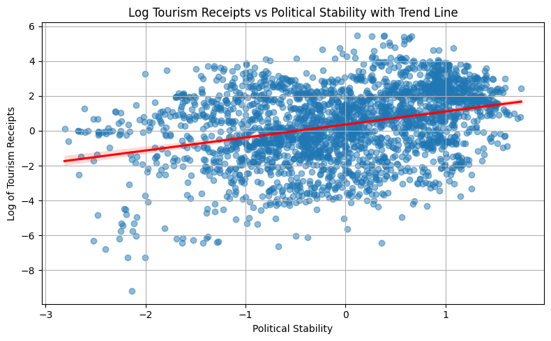
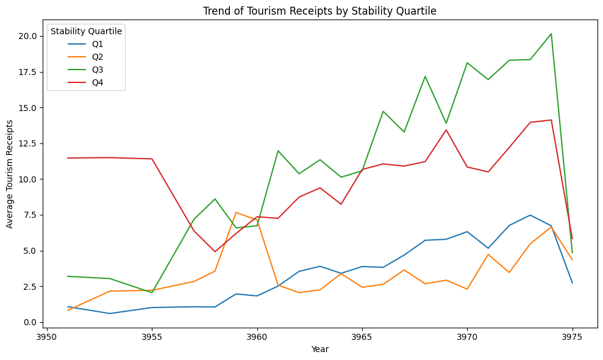

# Tourism Revenue and Political Stability Analysis

This project investigates whether improvements in political stability are associated with increased international tourism revenue, and how this relationship is moderated by disposable household income. The analysis is conducted using panel data from 1996–2023 across 180+ countries, incorporating economic, institutional, and tourism-related indicators.

---

## 1. Project Overview

This project explores the relationship between political stability and tourism revenue, aiming to understand whether a more stable political environment attracts more international tourism. A secondary focus is on how this relationship is moderated by household consumption, a proxy for domestic economic strength.

The results can support policymakers, tourism boards, and international development agencies by highlighting how domestic and institutional factors influence tourism income, which is vital for many economies.

---

## 2. Goals and Objectives

- **Primary Goal**: Determine whether increases in political stability are associated with higher levels of international tourism revenue.
- **Secondary Goal**: Explore whether this relationship is stronger in countries with higher levels of household consumption (i.e., domestic economic capacity).
- **Tertiary Goal**: Perform a robustness check using tourist arrivals as an alternative dependent variable.

---

## 3. Data Sources and Key Features

### Sources:
- [World Bank Open Data](https://data.worldbank.org): Including time-series indicators on tourism, macroeconomic performance, and institutional quality.
- The dataset was manually merged and reshaped into long format for multi-country, multi-year panel analysis.

### Key Variables:
- **Tourism Receipts** (`tourism_receipts`): USD revenue from international tourism.
- **Political Stability** (`political_stability`): Worldwide Governance Indicators index.
- **Household Consumption** (`household_consumption`): Proxy for disposable income.
- **Control Variables**:
  - `gdp_ppp`: GDP per capita (PPP)
  - `inflation`: Consumer price index
  - `exchange_rate`: Local currency per USD
  - `unemployment`: % of labor force
  - `fdi`: Foreign direct investment (net inflows)

Derived features:
- **Interaction Term**: `political_stability * household_consumption`
- **Quartile Classifications**: Based on political stability levels

---

## 4. Data Preparation and Feature Engineering

### Cleaning & Transformation:
- Skipped non-numeric rows in raw .csv files
- Converted from wide to long format using pandas
- Merged on `countryname` and `year`
- Ensured numeric values and converted strings to floats

### Feature Engineering:
- Created `interaction` = `political_stability * household_consumption`
- Computed quartiles for `political_stability`
- Applied log transformations where appropriate (in early testing)

---

## 5. Econometric Modeling

### Modeling Approach

To investigate the impact of political stability on international tourism revenue, the project utilizes **panel data econometrics**—specifically, **fixed-effects (FE) models**—which control for time-invariant unobserved heterogeneity across countries. This method ensures that comparisons are made within countries over time, isolating the effects of political and economic changes from static national characteristics like geography, culture, or baseline development levels.

The analysis leverages both **STATA** (for robust academic-style fixed effects estimation) and **Python's `statsmodels`** (for reproducibility and visualization in the Jupyter notebook). Standard errors are clustered by country to address potential heteroskedasticity and serial correlation.

### Estimated Models

Three main models are constructed:

1. **Baseline Model**  
   - Explores the direct linear association between political stability and tourism receipts, controlling for key macroeconomic variables: household consumption, GDP per capita (PPP), inflation, exchange rate, unemployment, and foreign direct investment (FDI).
   - This model provides an initial estimate of the average effect of political stability on tourism revenue across countries.

2. **Interaction Model**  
   - Incorporates an interaction term between political stability and household consumption to test whether the effect of political stability is conditional on a country’s income level.
   - This model is motivated by the hypothesis that political stability may have greater economic returns (via tourism) in countries with higher levels of domestic spending power.

3. **Robustness Model (Tourist Arrivals as Outcome)**  
   - Substitutes the dependent variable (tourism receipts) with **international tourist arrivals** to assess whether the main findings are robust to different measures of tourism performance.
   - This approach accounts for potential issues in revenue reporting or pricing differences across countries.

### Summary

Across all models, political stability shows a **positive and statistically significant relationship** with tourism performance. The interaction model further suggests that the **economic benefits of stability are amplified in higher-consumption countries**, highlighting a moderating effect of domestic income levels. The robustness check using tourist arrivals confirms that these results are not driven by measurement artifacts in revenue data.

These findings underscore the importance of political stability not just for general economic growth, but also for enhancing a country's attractiveness and performance in the global tourism market.

---

## 6. Visualizations and Insights

- Boxplot: Tourism receipts across political stability quartiles  
  

- Interaction Plot: Predicted receipts by combinations of stability and income  
  

- Correlation Heatmap: Relationships between all model variables  
  

- Scatter Plot: Political stability vs. tourism receipts  
  

- Trend Plot: Receipts over time grouped by political stability levels  
  

---

## 7. Results

- **Political stability** has a statistically significant and positive effect on international tourism revenue.
- The **interaction term** confirms that countries with higher household consumption benefit more from political stability.
- **GDP per capita**, **FDI**, and **inflation** are significant and behave as theoretically expected.
- The **tourism arrivals** model reinforces the robustness of the core results.

---

## 8. Challenges and Limitations

- **Missing Data**: Political stability metrics are only available from 1996 onward, reducing the time range.
- **Proxy Variables**: Household consumption is used as a proxy for disposable income.
- **Unbalanced Panel**: Some countries drop in and out across years due to data gaps.
- **Stationarity Not Tested**: No time-series diagnostics or adjustments were applied.
- **Exchange Rate Variation**: Effects of exchange rate volatility may differ widely between countries.
- **Omitted Variables**: Exclusion of institutional factors like corruption, democracy index, or security concerns could bias results.

---

## 9. Future Directions

- Apply **Poisson fixed-effects regression** to better model count-based outcomes like tourist arrivals.
- Consider dependent variables like **tourism receipts per capita** or **% of GDP** for normalization.
- Incorporate **political and institutional indicators** (e.g., regime type, conflict index).
- Analyze **lagged effects** of political stability to capture long-term tourism responses.
- Conduct **regional sub-panel analysis** (e.g., EU, ASEAN, Africa).
- Use **dynamic panel methods** (e.g., Arellano-Bond GMM) to test causality and account for inertia in tourism flows.

